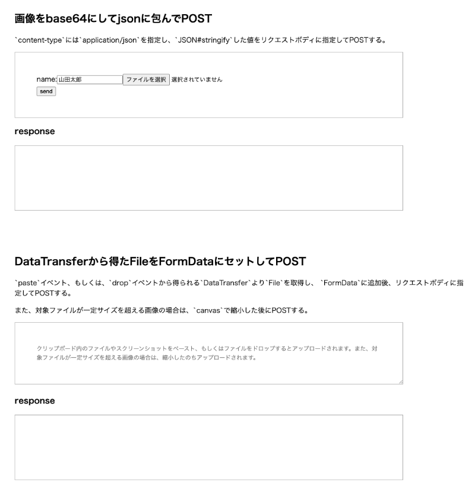

# file-upload-examples

ファイルアップロード処理の実装のサンプル集。

- File を含まない form 要素による POST1
- File を含まない form 要素による POST2
- File を含む form 要素による POST1
- File を含む form 要素による POST2
- File 自体をリクエストボディに指定して fetch で POST
- Form 要素から生成した FormData をリクエストボディに指定して fetch で POST
- 自前で組み立てた FormData をリクエストボディに指定して fetch で POST
- 画像を base64 にして json に包んで POST
- DataTransfer から得た File を FormData にセットして POST（スクリーンショットや D&D によるファイルのアップロード）

## 実行手順

```bash
$ npm run setup
$ npm run build
$ npm start
localhost:3000
```

http://localhost:3000/ にブラウザでアクセス。



## ソースコード

- バックエンド
  - [app/index.ts](https://github.com/cyokodog/file-upload-examples/blob/main/app/index.ts)
- フロントエンド
  - [frontend/src/components/\*.tsx](https://github.com/cyokodog/file-upload-examples/tree/main/frontend/src/components)
